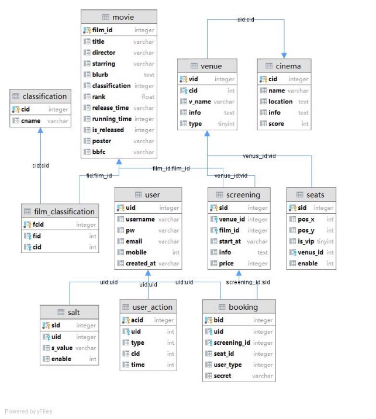
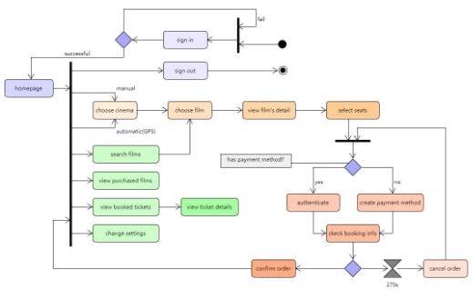
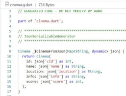
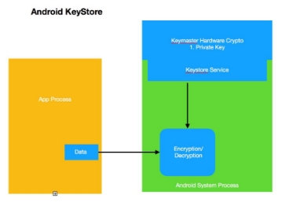
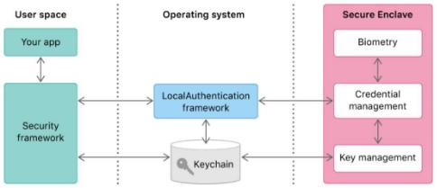
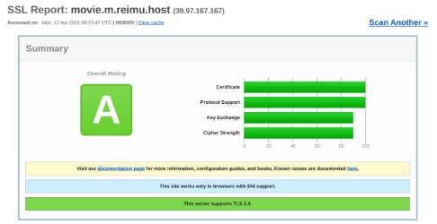
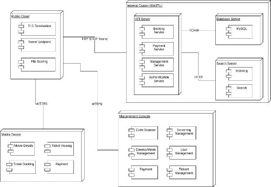

**Ticket Booking System for Movie theater** 

**GearBlade Studio Demo Project** 

1. **Database design** 
2. **Database environment** 

The database of this project is built and maintained by MySQL relational database management system. The database design process uses SQLite database management tool to create, modify and delete data tables. The tool can export or run SQL files, which greatly simplifies the establishment and management of the database. At the same time, the tool can be used to easily view the relationship between the database data tables. 

2. **Development Guidelines** 

The database design for this project satisfies the following rules. 

- primary key-foreign key relationships, inter-table relationships, and fields in tables that are non- divisible attributes. 
- reasonable functional division of tables. 
- reasonable naming, type and length of fields. 
- data tables are named in lower case, which is more intuitive. 
- For intermediate data tables that link two tables, the names are spaced with underscores. 
3. **Logical Design** 

The database of this system is designed in accordance with object-oriented thinking, corresponding entity  classes,  and  the  corresponding  database  tables  are  generated  by  entity  classes,  and  the relationships between data tables reflect the relationships between objects. 

4. **Database Implementation** 
- **booking**: Store the users’ order, including order ID, user ID, session ID, seat ID, user type and order key. 
- **screening**: Store information including movie screenings, including screening ID, venue ID, movie ID, show dates, display and price. 
- **venue**: Contain the theater ID, the name of the theater, the theater ID, the theater information, and the category of the theater. 
- **cinema**: Store movie theater information, including movie theater ID, movie theater name, geographic location, information, and rating. 
- **seats**: Include seat-related information, specifically seat ID, X coordinate, Y coordinate, whether it is VIP, theater ID, whether it is available. 
- **classification**: Store the category of the film, including the classification of the ID and category name. 
- **film\_classification**: Store the movie and film category mapping, including mapping ID, movie ID and category ID. 
- **movie**:  Store  movie-related  information  including  movie  ID,  movie  name,  director,  actor, introduction, classification, score, show date, movie length, whether it is released, poster and buff classification. 
- **user**: Store user information, including user ID, username, encrypted password, email, phone number and registration date. 
- **salt**: Store the encrypted information of the user password (salt value), comprises a salt value the ID, the user the ID and the salt value 
- **user\_action**: Store the user's operation information, including the user ID, operation type, and operation date 
5. **ER Diagram** 

6. **Database optimization** 
- Partition to improve query speed. By partitioning and storing tables that store massive amounts of data, query performance can be greatly improved, and maintenance is facilitated. 
- The use of stored procedures and indexes. Using  stored procedures to implement complex database operations can not only be more scalable, but also improve execution efficiency. 
- Separate reading and writing data. In the database cluster service, read and write operations are performed  on  different  servers,  which  can  greatly  improve  the  overall  performance  of  the database. 
- Optimize the query statement. Reduce the frequency of use of like and or statements as much as possible. 
- Improve data connection pool and caching technology. Using caching technology in the data connection  pool,  optimizing  connections,  and  releasing  resources  as  much  as  possible  can improve execution efficiency. 
3. **Outline design** 
1. **User Story** 

Initially  the  user  can  browse  the  page  as  a  visitor,  but  if  he  makes  up  his  mind  to  make  a reservation/purchase a ticket, then he must log in. If the user does not have an account, he will be led to sign up for himself. Then, the user can search for a movie or view specific information about a movie. After the user selects the movie he wants to see, he must select the screening and then go to the theater corresponding to the screening and select the seat. Finally, the user can pay and reserve the tickets by bank card. 

2. **Flow Chart** 

3. **Overall architecture** 

The mobile application is developed based on Flutter 2.0, a cross-platform application development framework released by Google that uses an MVVM approach, where the view is controlled by its view model with the help of the underlying model. 

It runs on Android, iOS, browsers and major desktop platforms. Our application runs only on Android and iOS as it utilizes special native features such as encrypted storage and biometric authentication. As such, it contains Dart code for the user interface and business logic, as well as Java and Swift code for native API interactions. 

UI  components  and  functional  components  are  organized  into  widgets  in  Flutter  (a  complete application is a single widget that has many children), which makes them easy to combine and reuse. The application uses Riverpod, Flutter Hooks, and RxDart for state and data flow management, Hive for data persistence, and Dio for HTTPS requests. 

For API requests, Dio automatically injects relevant HTTP headers (including authorization, user agent) into the request so that the back-end server can identify the application and the user. API responses are automatically transformed into Dart objects with generated serialization code. The result is then sent to the stream and the provider, which distributes the data to the user interface. 

4. **Project Layout** 

The mobile project has the following layout, conforming to Flutter’s official standards: Android - Android specific code 

Assets – Essential resources, such as images and fonts 

IOS – iOS specific code 

lib – Flutter code 

- api – API accessing code 
- components – common widgets, such as buttons, film cards, and lists 
- models – data models and serialization 
- screens – UI screens and specific widgets, organized in directories 
- utils – common utilities, such as date formatting and timing 

Test – Flutter tests 

5. **State Management (MVVM, streams, and providers)** 

A typical widget which uses external data starts like this (ticket list for example): 

In Flutter, widgets themselves are temporary. They are destroyed and re-created when the UI is refreshed, but they can be connected to a State, which is kept during refreshes unless the widget is no longer in the tree. In this code, HookWidget creates a hidden state for the screen widget. 

The widget then subscribes to a stream, which provides a list of tickets for the widget to display, and the hook system will automatically refresh the widget when the stream provides new tickets. Stream and Subject is a powerful mechanism in Dart, it represents a continuous stream of events (in this case a list of tickets) asynchronously and notifies all listeners when a new event is ready. In our application, it is used for data persistence, lazy loading from API, and refreshing (pull-to-refresh actions). 

More advanced providers can be created using the following code. Providers fetch data from the API when it is read for the first time and caches the data until the application is closed. It can also be refreshed when required.

Streams and providers are the main data flow management tools used in our application, they provide a centralized data loading solution so that all components can read the data they need easily and in real time. They also ensure that all relevant data (such as those derived from the main movies provider) is correctly and timely updated whenever any of its dependency updates. 

6. **Data Models and Persistence** 

The application has a number of models, including ticket, movie, cinema, screening, seat, user, credit card, and actor. Some models are only used locally, others require persistence and/or deserialization from API responses. Each model is represented as a Dart class. 

Generally,  data  persistence  on  mobile  devices  is  implemented  with  SQLite,  which is  available everywhere. However, it is not easy to use for complex structured data such as movie tickets, which are stored both on the server and locally so that the user is still able to look up the ticket if the network at  the cinema is unstable and remote data cannot  be loaded. We also need to  save credit card information and other user settings locally. 

We utilized Hive for data storage, it is a fast and lightweight pure dart solution that stores data in a compact binary format like Protocol Buffer on the disk with optional encryption. Hive depends on custom adapters (automatically generated) to store non-primitive types (such as the credit card class), which can be created using the following code: 

 

In this way, local information can be stored in a compact and backwards-compatible way, which is ideal for a client application. The data persistence features are tightly integrated with streams and providers, providing a seamless experience even if the server can’t be reached. 

Code related to JSON serialization and backend communication can be generated in the same way, saving development time. 

7. **Native Features** 

The application integrates a number of native features that are not easy to  use on a web-based application. 

- Push Notifications: 

To remind the user that a booked movie is about to start, a push notification with sound can be scheduled and sent by the application. 

Similar notification is sent when certain operations (such as refunds, these operations can take a long time to process, it is not feasible to make the user wait in the app) are completed. Clicking on the notification will take the user directly to the screen with the help of deep linking. 

- Biometric Authentication: 

The application requires fingerprint authentication at several points, especially when the user is about to make a payment. The actual authentication method depends on what’s actually available on the device, it can be PIN code, fingerprint, or facial recognition. 

- GPS Location: 

The application uses the Geolocator package to acquire GPS location when it is launched, or the user presses the location icon. We then compare the user’s coordinates with the list of cinemas from the backend, to recommend the nearest cinema to the user. 

8. **Overall interface design** 

|Interface name|Authority|parameter|Features|
| - | - | - | - |
|Log in|Arbitrary|account password|user login|
|Register|Arbitrary|
Account, password, 

personal information
|User registration|
|Get\_user\_info|Arbitrary|token|Obtain user personal data|
|Get\_users\_info|admin|empty|Get information about all users|
|Insert\_film|admin|Movie information|Insert movie information|
|Film\_search|Arbitrary|Movie field|Search movie information|
|Cinemas\_info|Arbitrary|empty|Get movie theater information|
|Venue\_info|Arbitrary|Cinema ID|Obtaining auditorium information|
|Films\_info|Arbitrary|empty|Get movie list|
|Cinema\_film|Arbitrary|Movie ID|Get a list of movie theaters with selected movies|
|Screenings\_film|Arbitrary|Cinema ID, Movie ID|Get a list of shows through cinemas and movies|
|Screenings\_info|Arbitrary|Screening ID|Get screening information|
|Seats\_map\_info|Arbitrary|Auditorium ID|Get the seating chart of the auditorium|
|Booked\_map\_info|Arbitrary|Session ID|Get the subscribed seat table for this session|
|Booking|user|Booking information|Carry out a ticket booking operation|

1. **Security** 

Security is of great importance in this software project, as the application is required to handle payments and sensitive information, including but not limited to mobile phone number, passwords, and credit card or other payment information. In a real project, handling credit card information might need more security measures required by the bank and other related agencies, but this is currently not considered. 

This project utilizes various state-of-art security technologies and practices, divided into three parts: client  (mobile application or admin portal), transport  (when the data is exchanged through the Internet), and server (backend API and database). 

1. **Client-side Security** 
1. **User authentication (login, register, and logout)**：** 

The user uses his/her mobile phone number to create an account in the system. In the registration page,  the  application  uses  reCAPTCHA  system  to  check  if  an  actual  human  is  operation  the application, not an automated program, as SMS verification can cost a lot if it is abused. A password with at least 8 characters and mixed alphabet and number is required. Upon registration, the user will receive a SMS message with a PIN code, which should be typed into the application and verified before the account is activated. An authentication token will be generated by the server when the user is registered or logged in, the token is injected into the headers of every HTTP request to the API server, identifying the user. 

This authentication token is stored in a hardware-backed storage space with Flutter Secure Storage, which provides an API to the operating system’s secure storage (Keychain on iOS, KeyStore on Android). This storage space can never be read by other application, and is locked behind the user’s phone PIN, only accessible after the phone’s screen is unlocked. This technology makes full use of security features in modern devices, such as ARM’s TrustZone and Apple’s Secure Enclave. The user can also reset the password if it is forgotten with the same SMS verification mechanism. 

2. **Credit card information** 

The actual credit card information is stored in the application’s storage space, but it is encrypted. The cards are stored with Hive (a pure-dart data persistence solution), which provides an option to encrypt a storage box with AES-256 strong encryption. When the application is launched for the first time, a random AES-256 key is generated by the system’s crypto random generator and stored into the same hardware storage space mentioned above. This key is later used to encrypt and decrypt the storage box for credit cards. Therefore, the user’s credit card information is only transmitted when a payment is being made, and only the card being chosen is sent. 

The encryption key and other related data is deleted when the user logs out of the application. 

3. **Credit card information** 

The actual credit card information is stored in the application’s storage space, but it is encrypted. The cards are stored with Hive (a pure-dart data persistence solution), which provides an option to encrypt a storage box with AES-256 strong encryption. When the application is launched for the first time, a random AES-256 key is generated by the system’s crypto random generator and stored into the same hardware storage space mentioned above. This key is later used to encrypt and decrypt the storage box for credit cards. Therefore, the user’s credit card information is only transmitted when a payment is being made, and only the card being chosen is sent. 

The encryption key and other related data is deleted when the user logs out of the application. 

4. **Payment** 

As mentioned above, credit cards and other payment related information is locked behind the user’s phone credentials, which means that a PIN, fingerprint, or face recognition authentication is required before the app can access such information. This essentially makes Alipay-like “fingerprint payment” process possible, providing a great balance between convenience and security. 

Other payment information is securely encrypted with HTTPS, which will be discussed later. 

5. **XSS protection** 

The mobile application is not affected by XSS, as it is not a web page and does not use HTML and JavaScript. The admin portal is entirely developed with Vue.js, which internally filters all text when creating the HTML DOM structure, preventing XSS. 

2. **Transport Security** 

Following industry’s best practices (Android and iOS have started blocking plain-text HTTP requests from applications a few years ago), all resources for the web-based admin portal and all traffic between the server and the clients are protected with TLS. 

3. **(HTTPS) and HTTP 2.** 

This means that no extra measures are required to protect the data from wiretapping as they are always fully encrypted, and the operating system prevents us from accidentally sending unencrypted requests. Modern TLS also provides forward secrecy, which means that the packets can only be decrypted for a short amount of time and can never be decrypted if the keys on the server are later leaked. This is better than encrypting request data with simple AES, which does not provide such feature.  

The API server’s TLS setup got an “A” in the industry-standard TLS verification report. 

4. **Server-side Security** 
1. **Password protection** 

The user’s password is hashed with a unique salt for each user using MD5 hashing algorithm. The hashing salt is derived from the user’s ID, requesting IP, timestamp, and a random number, then stored in the database alongside the hashed password. When the user logs in, the password given by the user is hashed with the same method and compared with the stored password. 

This method makes sure that the user’s original password remains secure in the event of an attack that leaked the database contents. It is not possible to recover the original password from the hash. 

2. **SQL injection protection** 

SQL injection happened when the user’s input is directly put into the SQL query without filtering, so that the user can execute malicious SQL code by altering the query’s structure. 

The backend code makes extensive use of placeholders, as shown above. This means that user- provided data is sent separately by the database driver and never present in the query, making SQL injection impossible. 

5. **Database failover and backup and recovery** 

On the one hand, in the data backup and recovery plan, we must take strict precautions as much as possible to prevent the storage data from being damaged; on the other hand, in the case of storage data damage, we can restore the data in time and make it as possible complete.  

File service backup adopts dual-system hot backup technology, that is, one server is used as a working server and the other server is used as a backup server, connected through a high-speed intranet. When the primary server fails, it can automatically failover and start the backup server to ensure that the normal operation of the service will not be interrupted. In addition, a separate server will be set up to back up the file server in real time. 

Database backup: MySQL database server cluster is used to flexibly allocate node resources. When the main database service fails, the failure can be transferred immediately to ensure that the service is not interrupted. In addition, a separate server will be set up to back up the database files. 

When deploying a cluster system, you can set how many nodes need to be allocated for one node data. When the current node fails, the name node will automatically enable backup data and continue to distribute the data to other nodes to ensure a constant amount of data sharing. Here are some options for more precise usage: 

|Options |Descriptions  |Required Data |
| - | - | - |
|Restore  the  database  to  the  most recent state |Restore  the database  to  its most recent state |
Recent  data  backup  (File, Backint or storage snapshot) 

- log backup after data backup 

- data in log area 
|
|Restore the database to a specified point in time |/ |
Recent  data  backup  (File, Backint or storage snapshot) 

- log backup after data backup 

- data in log area 
|
|Restore the database to a specified data backup or storage snapshot |/ |Specify data backup |
|Restore the database to a log location |Handling recovery failures |
Data backup before log location 

- Log backup after data backup 

- data in log area 
|
7. **Deployment** 
1. **Back-end deployment** 

The backend services are deployed with docker-compose, which is a versatile technology that enables deployment on local servers as well as clouds. It can even automatically deploy different services on different physical machines when required. 

The final deployment diagram is shown below. 

The final deployment consists of two parts: a public gateway hosted on Ali-Cloud, and a internal server hosted in SWJTU. 

2. **Docker and docker-compose** 

Docker is a technology used in almost every software deployments today. It uses Linux kernel’s cgroups feature to create isolated containers that comes with everything an application depends on and does not affect each other, so that one can make full use of the resources on a physical or virtual machine without security concerns. Docker also provides pre-configured containers for components such as database servers, storage services, including our search service. 

Docker-compose is a companion tool for docker that groups containers together and creates a virtual network among them, each container acts as if they were individual machines. It also handles common tasks such as updating, initial configuration, port mapping, and environment variables. 

In our project, a single docker-compose file is used to deploy the entire system automatically, it pulls in the application (node), database (MySQL), storage, and searching services, creates a docker network for these services, and exposes required ports to the host machine to be proxied by Caddy. 

3. **Caddy** 

Caddy is a high-performance web server (like Nginx), it runs on the public-facing gateway. It acts as the static file server for resources such as HTML and CSS for admin portal, fonts, generated PDF tickets, and poster images. Caddy is also a reverse proxy for the API server with compression, so it does not need to listen directly on port 80/443 and deal with CORS problems. 

It also handles TLS connections using TLS 1.3, automatically requests and renews the certificate so that the service is not interrupted when the certificate expires. 

4. **FRP Tunnel** 

A secure tunnel is created between the SWJTU server and public gateway using the FRP software’s STCP protocol, which encrypts the traffic in the tunnel with a pre-shared AES key. 

The tunneling solution is essential because the public server does not have enough resources (especially RAM) for all the required components. 

5. **Database cluster service deployment** 

In any case, it is not enough to provide high-quality applications with a rich feature set. Increasingly, it  must  also  meet  high-availability  standards.  In  this  solution,  we  can  design  high-availability applications through clusters. For service architecture. 

A cluster connects two or more servers together so that they appear as the same computer in the client. Connecting the servers in the cluster can share workloads, achieve a single point of operation and management, and provide a way to adjust to meet increasing demands. Multiple database servers are the primary server and a standby server. When the main service node fails, it can immediately switch to the standby server to ensure uninterrupted service and ensure system stability. 
55  **/  55**** 
